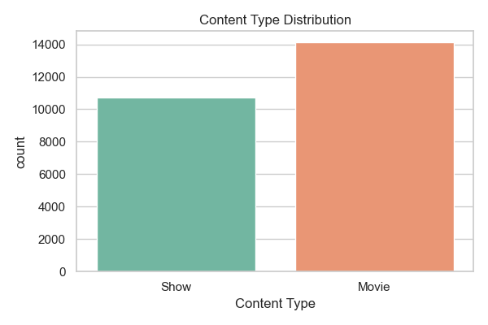
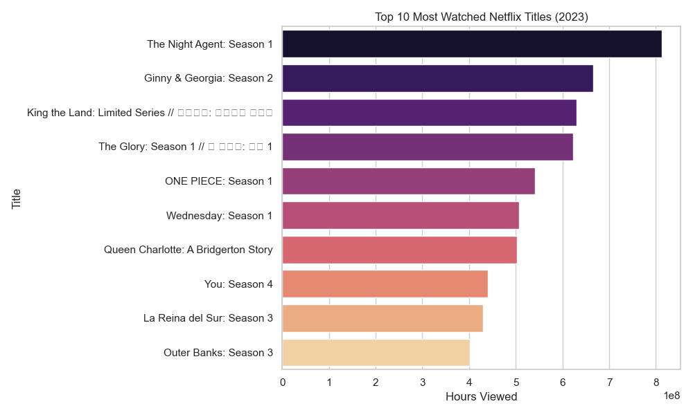
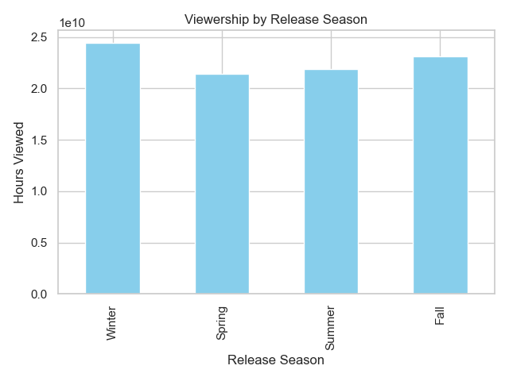
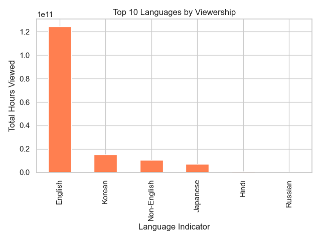
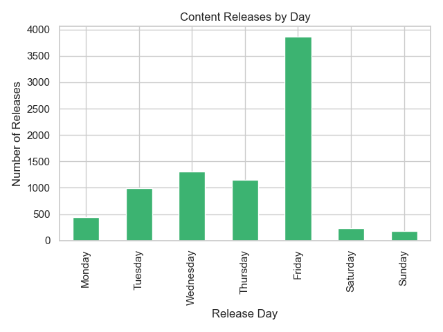

# Netflix-Analytics-Case-Study


Uncover how Netflix crafts content for global engagement — powered by Python, PowerBI, and binge-worthy data.

# 📺 Netflix Content Strategy Analysis (2023) 🎬

A complete data-driven breakdown of Netflix's 2023 content catalog — uncovering insights on what performed well, when content was released, and how language and type affected viewership. Built using Python, Pandas, and Seaborn, this project explores trends to support content strategy decisions with engaging visuals and data storytelling.

---

## 📌 Table of Contents

- [📖 About the Project](#-about-the-project)
- [📂 Dataset Overview](#-dataset-overview)
- [📊 Visualizations & Insights](#-visualizations--insights)
- [⚙️ Technologies Used](#️-technologies-used)
- [🧠 Key Findings](#-key-findings)
- [🛠️ How to Run](#️-how-to-run)
- [📁 Project Structure](#-project-structure)
- [🚀 Future Improvements](#-future-improvements)
- [🙋‍♂️ Author & Contact](#-author--contact)

---

## 📖 About the Project

**Netflix Content Strategy Analysis (2023)** is a data analysis project that leverages the power of Python to uncover insights about Netflix’s global content lineup. This project is aimed at:

- Identifying high-performing titles by viewership
- Analyzing seasonality and release day patterns
- Highlighting language-based content performance
- Supporting strategic release planning and content investment

---

## 📂 Dataset Overview

The dataset used is named `netflix_content_2023.csv`, containing the following key columns:

| Column Name        | Description                                      |
|--------------------|--------------------------------------------------|
| Title              | Name of the Netflix content                      |
| Content Type       | Type of content (Film, Series, Documentary)      |
| Language Indicator | Language in which the content was released       |
| Hours Viewed       | Total hours viewed globally (with commas)        |
| Release Date       | Date the content was released                    |

### 🔧 Data Cleaning Steps
- Removed commas from `Hours Viewed` and converted it to integer.
- Converted `Release Date` to datetime and extracted:
  - `Release Month`
  - `Release Day Name`
  - `Release Season` (Winter, Spring, Summer, Fall)

---

## 📊 Visualizations & Insights

### 1. 📦 Content Type Distribution

- Insight: Distribution across Films, Series, and Documentaries helps understand Netflix's content format focus.

---

### 2. 🏆 Top 10 Most Watched Titles

- Insight: Showcases the biggest content hits of 2023 and which titles drove massive engagement.

---

### 3. 🌱 Viewership by Season

- Insight: Winter releases had the highest total viewership, hinting at strategic content drops during cold months.

---

### 4. 🌍 Top 10 Languages by Viewership

- Insight: English dominates, but non-English content (Korean, Spanish, Hindi) attracts large audiences.

---

### 5. 📅 Content Releases by Day

- Insight: Most content is released on **Fridays**, aligning with global weekend binge-watching behavior.

---

## ⚙️ Technologies Used

| Tool/Library     | Purpose                          |
|------------------|----------------------------------|
| Python 3.11+      | Core programming language        |
| Pandas           | Data loading, cleaning, EDA       |
| NumPy            | Numerical operations              |
| Matplotlib       | Basic plotting                    |
| Seaborn          | Advanced, aesthetically pleasing charts |
| VS Code          | Development Environment     |

---

## 🧠 Key Findings

- **Friday is the favorite release day**, maximizing weekend engagement.
- **Winter content** outperforms other seasons in terms of total hours viewed.
- **Films are more numerous**, but **Series** tend to gather more total watch time per title.
- **Non-English titles are emerging** as strong performers, reflecting Netflix’s global content strategy.
- **Top 10 titles** account for a major share of total viewership — emphasizing the power of flagship content.

---

## 🛠️ How to Run

### 🔄 Step-by-step Instructions

1. **Clone the Repository**
   ```bash
   git clone https://github.com/your-username/netflix-content-analysis.git
   cd netflix-content-analysis

2. **📥 Install Required Packages**
   ```bash
   pip install -r requirements.txt

3. **🚀 Run the Analysis Script**
    ```bash
   python netflix_analysis.py


## 📁 Project Structure

```
📦netflix-content-analysis
 ┣ 📁assets/
 ┃ ┣ plot1_content_type.png
 ┃ ┣ plot2_top10_titles.png
 ┃ ┣ plot3_seasonal_viewership.png
 ┃ ┣ plot4_languages.png
 ┃ ┗ plot5_release_day.png
 ┣ 📄 netflix_analysis.py
 ┣ 📄 netflix_content_2023.csv
 ┣ 📄 requirements.txt
 ┗ 📄 README.md

```

## 🚀 Future Improvements
🌐 Convert to an interactive Streamlit Dashboard

📊 Add genre-based analysis

🤖 Use ML models to predict content success

📈 Build an interactive Power BI dashboard


## 🙋‍♂️ Author & Contact
### Muskkan Iyer
📧 muskkaniyer@gmail.com
🔗 [LinkedIn](https://www.linkedin.com/in/muskkaniyer/)
🔗 [GitHub](https://github.com/Muskkaniyer)


## ⭐ Support
- If you found this helpful:

- ⭐ Star this repository

- 🍴 Fork it and use it in your own projects

📬 Share your thoughts or suggestions


